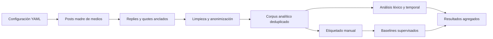

# HateCR

**Humanidades Digitales, NLP y análisis reproducible de conversación política en Costa Rica**

HateCR es un proyecto de Trabajo Final de Máster que estudia hostilidad, incivilidad y posibles expresiones de discurso de odio en conversaciones públicas de X durante la campaña electoral costarricense 2025-2026.

Este repositorio es la versión pública de portafolio. Incluye código, notebooks sin resultados incrustados, configuración metodológica y visualizaciones agregadas. El corpus, los textos, las etiquetas a nivel de comentario, los identificadores y las credenciales no se distribuyen.

## Qué demuestra el proyecto

- Diseño de una investigación de Humanidades Digitales de extremo a extremo.
- Recolección controlada mediante acceso autorizado a la API de X.
- Arquitectura `media_anchored`: la conversación se estudia alrededor de publicaciones de medios costarricenses.
- Limpieza, anonimización, deduplicación y trazabilidad del corpus.
- Construcción y aplicación de recursos léxicos en español.
- Etiquetado humano con separación conceptual entre hostilidad y discurso de odio.
- Baselines interpretables con TF-IDF, Logistic Regression y LinearSVC.
- Validación cruzada agrupada por post madre para reducir fuga de información.
- Análisis temporal, léxico y de entidades políticas con advertencias metodológicas explícitas.

## Pregunta de investigación

¿Cómo se manifiestan la hostilidad, la incivilidad y las posibles expresiones de odio en las interacciones de X ancladas a publicaciones de medios costarricenses durante momentos clave de la campaña electoral 2025-2026?

## Diseño del corpus

La unidad de recolección es el **post madre** publicado por una cuenta activa incluida en `config/media_accounts.yaml`. La unidad principal de análisis es la respuesta pública asociada a ese post. Las búsquedas de posts madre siempre usan `from:{media_handle}`.

El corpus formal comprende seis momentos:

1. Inicio formal de campaña, 1 de octubre de 2025.
2. Primer encuentro/debate del TSE, 9 de enero de 2026.
3. Cierre de encuentros del TSE, 12 de enero de 2026.
4. Debate de Repretel y Radio Monumental, 27 de enero de 2026.
5. Cierre definitivo de campaña, 28 de enero de 2026.
6. Jornada electoral, 1 de febrero de 2026.



## Corpus formal

| Indicador | Resultado |
|---|---:|
| Momentos electorales | 6 |
| Medios ancla representados | 13 |
| Replies únicas en el corpus maestro | 6.202 |
| Textos en el corpus analítico | 5.239 |
| Textos deduplicados para modelado | 5.134 |
| Autores anonimizados únicos | 1.739 |
| Ejemplos con etiquetado humano combinado | 480 |
| Grupos de post madre en entrenamiento | 163 |


## Etiquetado humano

El esquema conserva tres decisiones relacionadas pero distintas:

| Variable | Interpretación |
|---|---|
| `hostility_relevance` | Nivel contextual 0-3 |
| `manual_hostility` | Presencia binaria de hostilidad o incivilidad |
| `manual_hate_speech` | Presencia binaria de discurso de odio |

Hostilidad no equivale a discurso de odio. La guía completa se encuentra en [`docs/manual_annotation_guide.md`](docs/manual_annotation_guide.md). Las muestras anotadas no forman parte del repositorio público.

## Baselines supervisados

Los modelos v2 se evaluaron mediante `RepeatedStratifiedGroupKFold`, con 5 pliegues, 5 repeticiones y agrupación por `source_post_id`. Las métricas siguientes corresponden a decisiones fuera de muestra con umbral por defecto.

| Target | Modelo | Accuracy | Precisión positiva | Recall positivo | F1 positivo | Macro F1 |
|---|---|---:|---:|---:|---:|---:|
| Hostilidad | Logistic Regression word+char | 0,690 | 0,758 | 0,714 | 0,735 | 0,680 |
| Odio, experimental | Logistic Regression word+char | 0,865 | 0,625 | 0,588 | 0,606 | 0,762 |


## Predicciones exploratorias

El perfil balanceado v2 marcó 2.242 de 5.134 textos como hostiles y 145 como posibles casos de odio. Estos porcentajes son **salidas exploratorias del modelo**, no estimaciones de prevalencia real. El muestreo enriquecido por lexicón, el tamaño del conjunto anotado y el desbalance de clases limitan su interpretación.


## Análisis temporal

El notebook 08 compara las fases previa, durante y posterior a cada acontecimiento, respetando la zona horaria de Costa Rica. Las celdas con menos de 20 observaciones se señalan como inestables y no sustentan conclusiones causales.


## Entidades políticas

El notebook 09 distingue entre mención, coaparición con hostilidad y destinatario probable. Una entidad mencionada dentro de un comentario hostil no necesariamente es el blanco del ataque.


## Flujo de notebooks

| Notebook | Función |
|---|---|
| `00_setup_y_validacion_api.ipynb` | Entorno, credenciales y diagnóstico seguro de endpoints |
| `01_identificar_posts_madre.ipynb` | Queries media-anchored y selección de posts madre |
| `02_recolectar_respuestas_x.ipynb` | Recolección controlada, batches y checkpoints |
| `03_limpieza_y_preprocesamiento.ipynb` | Limpieza, anonimización y corpus formal |
| `04_analisis_exploratorio.ipynb` | Calidad, volumen, temporalidad y muestra candidata |
| `05a_construir_lexicon.ipynb` | Integración manual de fuentes léxicas |
| `05_sentimiento_y_lexicon_odio.ipynb` | Aplicación del lexicón y scores exploratorios |
| `06_modelo_baseline_ml.ipynb` | Baselines supervisados iniciales |
| `06a_baseline_beta_lexicon_auto.ipynb` | Baseline automático basado en lexicón |
| `06b_analisis_errores_y_baseline_odio.ipynb` | Errores de hostilidad y baseline de odio |
| `06c_preparar_lote_etiquetado_activo.ipynb` | Selección de un lote de aprendizaje activo |
| `06d_reentrenar_modelos_lote_activo.ipynb` | Reentrenamiento y perfiles operativos v2 |
| `07_frecuencias_ofensivas_y_ngrams.ipynb` | Frecuencias, n-gramas y asociación léxica |
| `08_analisis_temporal_eventos.ipynb` | Fases antes, durante y después de eventos |
| `09_objetivos_hostilidad.ipynb` | Entidades mencionadas y blancos probables |

Todos los notebooks de esta versión pública tienen sus salidas y contadores de ejecución eliminados.

## Estructura pública

```text
HateCR-portfolio/
├── config/                 # Eventos, medios, términos y esquema metodológico
├── data/                   # Solo estructura; los datos no se distribuyen
├── docs/
│   ├── manual_annotation_guide.md
│   ├── REPRODUCIBILITY.md
│   └── showcase/           # Figuras y tablas exclusivamente agregadas
├── lexicons/               # Solo estructura; fuentes externas no incluidas
├── notebooks/              # Quince notebooks sin outputs
├── src/                    # Funciones reutilizables
├── DATA_AVAILABILITY.md
├── LICENSE_NOTICE.md
├── requirements.txt
└── README.md
```

## Instalación

```bash
# Después de clonar el repositorio:
cd HateCR
python3.11 -m venv .venv
source .venv/bin/activate
python -m pip install --upgrade pip
pip install -r requirements.txt
cp .env.example .env
jupyter lab
```

Para ejecutar la recolección se requiere acceso autorizado a la API de X y completar `X_BEARER_TOKEN` y `HASH_SALT` en el archivo local `.env`. La configuración pública mantiene las llamadas reales desactivadas por defecto.

## Reproducibilidad

Las instrucciones detalladas y el contrato de entradas se encuentran en [`docs/REPRODUCIBILITY.md`](docs/REPRODUCIBILITY.md). Los resultados agregados utilizados en esta presentación están documentados en [`docs/showcase/README.md`](docs/showcase/README.md).

## Ética y disponibilidad de datos

- No se distribuyen textos de X, usernames, IDs de usuarios ni archivos de etiquetado.
- Los autores comunes se anonimizan mediante SHA-256 y una sal privada.
- No se emplean scraping, Selenium, proxies ni técnicas de evasión.
- Los ejemplos violentos no se publican fuera de contextos metodológicamente justificados.
- Los resultados de clasificación son exploratorios y requieren validación humana.
- El corpus está anclado en medios y no representa toda la conversación política de X.

Consulte [`DATA_AVAILABILITY.md`](DATA_AVAILABILITY.md) antes de reutilizar el proyecto.

## Limitaciones

- El corpus depende de las cuentas de medios, ventanas temporales y disponibilidad de la API.
- El etiquetado enriquecido por lexicón no es una muestra aleatoria del universo de X.
- La clase de odio es minoritaria y sus métricas tienen mayor incertidumbre.
- Coaparición entre una entidad y hostilidad no prueba que la entidad sea el blanco.
- Los porcentajes modelados no deben presentarse como prevalencia poblacional.

## Tecnologías

Python, pandas, NumPy, scikit-learn, spaCy, NLTK, matplotlib, Jupyter, YAML, API de X y Git.

## Estado

Showcase metodológico y analítico de un TFM en desarrollo. La versión pública prioriza reproducibilidad, protección de datos y comunicación responsable de resultados.
